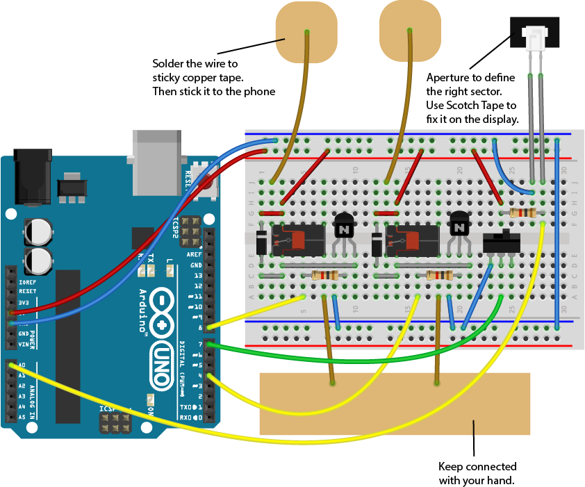

ArduinoPlaysTimberman
=====================

A simple programm for Arduino that plays Timberman.
Arduino High Score: 2417

Demo:
https://vimeo.com/101663279

Components used:

* JZC-11F RELAYS attached to TIP120 (The TIP120 can be replaced by many common NPN Transistors) attached to pins 4 and 8.
* OP580DA PHOTODARLINGTON NPN attached to A0
* SWITCH attached to pin 7
* All resistors are 1K Ohm

Setup:

Possition the PhotoDarlington on the right side on top of the background tree where the 3th leave possition would stop.

Circuit (components look different):

created July 23th 1014
by Valentin Heun

